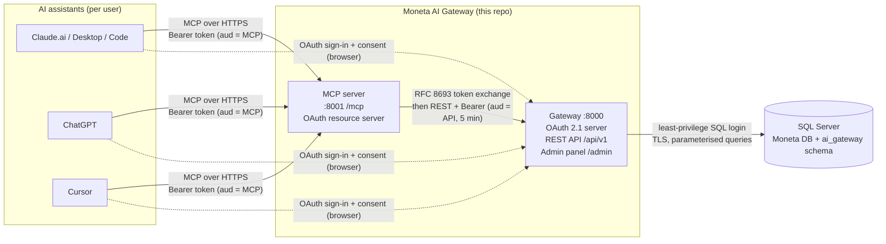

# Moneta AI Gateway (MVP)

A secure bridge between **AI assistants** (Claude.ai, Claude Desktop/Code, ChatGPT, Cursor, ...) and **Moneta ERP** (Innovasys).
One **MCP server** serves every assistant. It reaches the ERP only through a hardened **REST API**, and a small **administrator panel** controls who can use which assistant and what it may do.



## What it does

| Capability | MCP tool | REST endpoint | Scope |
|---|---|---|---|
| Sales reports (by product / customer / category / month) | `sales_report` | `GET /api/v1/reports/sales` | `reports:read` |
| Import products from documents (price lists, invoices, Excel) with preview first | `import_products` | `POST /api/v1/products/import` | `products:write` |
| Create sales orders (as **drafts**, prices from ERP, idempotent) | `create_order` | `POST /api/v1/orders` | `orders:write` |
| Lookups used by the AI | `search_products`, `search_customers` | `GET /api/v1/products`, `/customers` | `products:read`, `customers:read` |

Claude reads the document you attach (PDF, Excel, photo of a price list). It then calls `import_products` with `confirm=false` and shows you the preview. Nothing is written until you approve.

## Quick start (5 minutes, SQLite)

```bash
git clone https://github.com/iamalexninov/mcp-moneta.git && cd mcp-moneta
python3 -m venv .venv && source .venv/bin/activate
pip install -r requirements.txt
cp .env.example .env

python -m gateway.cli init-db
python -m gateway.cli create-admin --tenant "Demo Company" --email admin@demo.bg --name "Admin"   # prompts for password
python -m gateway.cli seed-demo --tenant "Demo Company"
python -m gateway.cli register-mcp-server        # copy MCP_CLIENT_SECRET into .env

uvicorn gateway.main:app --port 8000             # terminal 1: gateway + admin panel
python -m mcp_server.server                      # terminal 2: MCP server

python scripts/e2e_demo.py --email admin@demo.bg --password '<your password>'   # acts exactly like Claude
pytest -q                                        # 35 security & functional tests
```

Admin panel: http://localhost:8000/admin. To connect **Claude.ai** you need public HTTPS URLs; see [docs/04](docs/04-mcp-server-and-claude.md).

## Documentation

| # | Document | What's inside |
|---|---|---|
| 0 | [**Local quick start**](docs/00-local-quickstart.md) | Step-by-step: run and test everything on your PC (Windows/macOS/Linux), then Claude.ai and SQL Server |
| 1 | [Architecture](docs/01-architecture.md) | Components, request flow, design decisions, how it's built |
| 2 | [Running & deployment](docs/02-running.md) | Local, tests, Docker Compose, production |
| 3 | [**Security: authentication & authorization research**](docs/03-security-authn-authz.md) | Threat model, standards, every control and why, alternatives considered, AI-specific risks, compliance |
| 4 | [MCP server & Claude.ai (free) integration](docs/04-mcp-server-and-claude.md) | Tools, connecting Claude.ai / Desktop / Code, ChatGPT, Cursor, troubleshooting |
| 5 | [Connecting Microsoft SQL Server](docs/05-mssql-connection.md) | **When and how** to connect MSSQL, logins, TLS, mapping to the real Moneta schema |
| 6 | [REST API reference](docs/06-rest-api.md) | Endpoints, payloads, errors |
| 7 | [Admin panel](docs/07-admin-panel.md) | Screens and admin tasks |
| 8 | [Production checklist & roadmap](docs/08-production-checklist.md) | What to do before real client data, next steps |
| 9 | [**Hosting the prototype (HTTPS for Claude.ai)**](docs/09-deploy-prototype.md) | Tunnel from your PC, or a small cloud server with Docker + automatic HTTPS |
| 10 | [**MonetaDemo: local SQL Server database**](docs/10-moneta-demo-database.md) | Moneta-like tables, views, functions and stored procedures for SSMS, with a read-only `ai_api` layer |

## Repository layout

```
gateway/            REST API + OAuth 2.1 authorization server + admin panel (FastAPI)
  oauth/            discovery, DCR, authorize/consent, token, token-exchange, revoke
  api/              /api/v1 routes, strict schemas, auth dependency (scopes, tenant, revocation)
  services/erp.py   the ONLY code touching ERP tables (swap for real Moneta views/procedures)
  security/         Argon2id, ES256 keys/JWT, CSRF, rate limit, TOTP login, hash-chained audit
  admin/            server-rendered admin panel (no JavaScript, strict CSP)
mcp_server/         MCP server (official Python SDK v2, Streamable HTTP, token verification, token exchange)
sql/mssql/          SQL Server scripts: database, least-privilege logins, schema, ledger audit, Moneta mapping example
sql/moneta_demo/    MonetaDemo: Moneta-like ERP database (tables, views, functions, procedures, demo data)
tests/              pytest suite (runs on SQLite or SQL Server)
scripts/e2e_demo.py end-to-end client that behaves like Claude.ai
deploy/, Dockerfile, docker-compose.yml
```

## Status

This is an **MVP / prototype**. It runs end-to-end and has been tested on SQLite and SQL Server 2022. Before any real client data flows through it, work through [docs/08](docs/08-production-checklist.md). In particular: use a **commercial Claude plan** (Team/Enterprise/API), not the consumer Free plan, for client data. [docs/03 §9](docs/03-security-authn-authz.md#9-data-protection-and-compliance) explains why.
