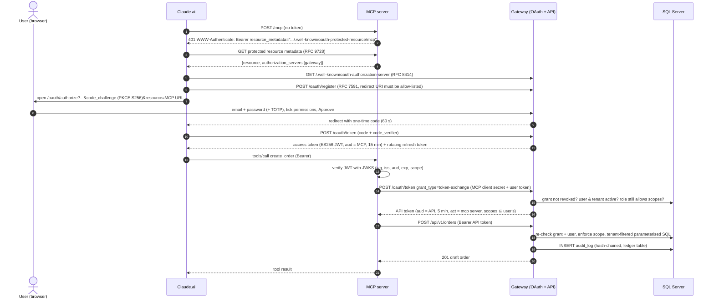

# 1. Architecture: how it is built

## 1.1 The problem

Innovasys' client wants to use Claude.ai inside its Moneta ERP workflow: reports, product imports, campaigns, orders and reading documents. Later they may want ChatGPT, Cursor or other assistants too. The client's business data must stay under strict control:

* Every **user** acts with their **own identity and permissions**. There are no shared "AI super-accounts".
* An AI assistant must **never** touch the database directly.
* Access must be **revocable instantly** and **fully audited**.
* The solution should support **many assistants** without building one integration per vendor.

## 1.2 Why MCP

The [Model Context Protocol](https://modelcontextprotocol.io) is the open standard AI assistants use to call external tools. Claude.ai (web, desktop, mobile), Claude Code, ChatGPT (developer mode connectors), Cursor, VS Code and others all speak it. **One MCP server therefore serves every AI assistant**. That is the "one MCP server that stores all AI agents" idea from the brief. The server doesn't *contain* the chatbots. It is the single, controlled door they all come through.

The MCP authorization spec (2025-11-25) standardises security on **OAuth 2.1**. We therefore implement a standards-compliant OAuth authorization server, and every compliant client gets per-user sign-in for free.

## 1.3 Components

| Component | Tech | Port | Responsibility |
|---|---|---|---|
| **Gateway** (`gateway/`) | FastAPI, SQLAlchemy 2 | 8000 | OAuth 2.1 authorization server, REST API `/api/v1`, admin panel `/admin`, audit log |
| **MCP server** (`mcp_server/`) | Official MCP Python SDK v2 (`MCPServer`), Streamable HTTP | 8001 | Exposes tools to AI assistants, verifies their tokens, exchanges them for API tokens, calls the REST API |
| **Database** | SQL Server 2022 (SQLite for dev) | 1433 | `ai_gateway` schema (security tables + demo ERP tables). In production, read/write the real Moneta DB through views and stored procedures |
| **Reverse proxy** | Caddy (or IIS / nginx / Azure Front Door) | 443 | TLS, one public origin, optional IP allow-list for Anthropic's egress range |

### Why two processes (MCP server ≠ REST API)?

* **Separation of trust.** The MCP server faces the internet and parses AI-generated input. It has **no database credentials**. If it were compromised, the attacker would hold only a client secret that can *exchange* existing user tokens. It cannot mint them and cannot reach SQL.
* **Reuse.** The REST API can also serve other integrations (a Moneta plugin, Power BI, n8n) with the same security model.
* **No token passthrough.** The MCP spec forbids forwarding the user's MCP token to upstream APIs. We use RFC 8693 token exchange (section 1.5).

## 1.4 The three business methods

| Method | Why this one | Safety design |
|---|---|---|
| **Sales report** `GET /api/v1/reports/sales` | The most requested AI use case ("how did we do last quarter?"). Read-only. | Aggregates only (no raw rows). Period capped at 366 days. `top` capped at 100. Tenant filter. |
| **Product import** `POST /api/v1/products/import` | Covers "read a document and include it". Claude extracts rows from a PDF/Excel/photo and the API validates them. | **Dry-run by default.** Strict schema (SKU regex, price bounds, max 500 rows, unknown fields rejected). `create_only` mode by default. Per-row result. |
| **Create order** `POST /api/v1/orders` | The highest-value write action. | Creates **drafts only**. **Prices and VAT always come from the DB**; a price in the request is rejected. Stock check, total cap (default €50,000), idempotency key (no duplicates on AI retries). |

"Campaigns" would follow the same pattern (e.g. `POST /api/v1/campaigns` creating a draft campaign). It was left out of the MVP to keep three well-hardened methods rather than many thin ones.

## 1.5 End-to-end flow

## 1.6 Multi-tenancy ("every customer has access")

* Each customer company is a **tenant**. Users, AI connections, audit entries and ERP rows carry `tenant_id`.
* The tenant is taken **only from the verified token** (`tid` claim, re-checked against the DB), never from request parameters.
* Every query in `services/erp.py` filters by tenant. `tests/test_api.py::test_tenant_isolation` proves tenant B can't see tenant A's data.
* Each tenant has its own admins, who see and manage only their own users, connections and audit trail.
* For extra isolation in production: one database per tenant, or SQL Server **Row-Level Security** keyed on `SESSION_CONTEXT` (see [05](05-mssql-connection.md)).

## 1.7 Code tour

| File | What to read it for |
|---|---|
| `gateway/oauth/routes.py` | The full OAuth 2.1 server: metadata, DCR, authorize/consent, token (code, refresh with reuse detection, token exchange), revocation |
| `gateway/api/deps.py` | How every API request is authenticated and authorized (5 checks) |
| `gateway/api/schemas.py` | Strict input validation (`extra="forbid"`, bounds, regexes, control-char stripping) |
| `gateway/services/erp.py` | All SQL. The only file to change when pointing at the real Moneta schema |
| `gateway/security/*` | Argon2id, ES256 keys/JWKS, JWT, CSRF, rate limiting, login/lockout/TOTP, audit hash chain |
| `gateway/admin/*` | Admin panel (sessions, CSRF, MFA enrolment, revocation) |
| `mcp_server/server.py` | Tool definitions, instructions to the model, prompts, transport security |
| `mcp_server/auth.py` | JWT verification against JWKS with audience binding |
| `mcp_server/api_client.py` | Token exchange + calling the REST API, error mapping |

## 1.8 Key technology choices

| Choice | Alternatives considered | Reason |
|---|---|---|
| Python + FastAPI | Django, Flask | Async, Pydantic validation built in, OpenAPI docs, same language as the MCP SDK |
| Official MCP SDK v2 (`MCPServer`) | FastMCP 2.x (third-party), hand-rolled JSON-RPC | Maintained by the MCP project, built-in RFC 9728 metadata + bearer middleware + DNS-rebinding protection |
| Own OAuth server in the gateway | Keycloak, Microsoft Entra ID, Auth0 | The MVP must run standalone. Production can swap in Entra ID/Keycloak (see [03 §4.6](03-security-authn-authz.md#46-build-vs-buy-the-authorization-server)). The MCP server only needs a JWKS URL. |
| ES256 JWT access tokens | Opaque tokens + introspection, HS256 | Verification with a public key only (MCP server can't mint tokens). Small signatures. No algorithm confusion. |
| SQLAlchemy 2 | raw pyodbc | Parameterised queries by construction, one codebase for SQLite and SQL Server |
| Server-rendered admin (Jinja2, no JS) | React SPA | Smallest attack surface: CSP `default-src 'none'`, no XSS gadgets, no token in browser storage |
