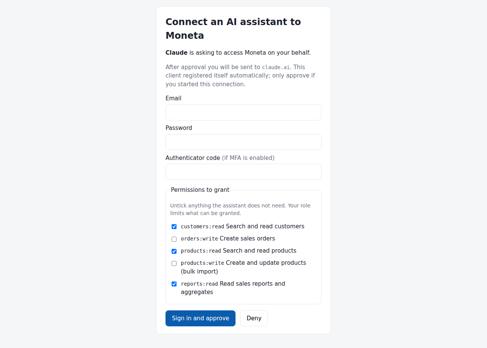
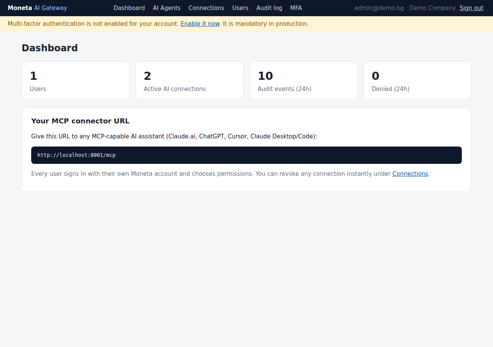
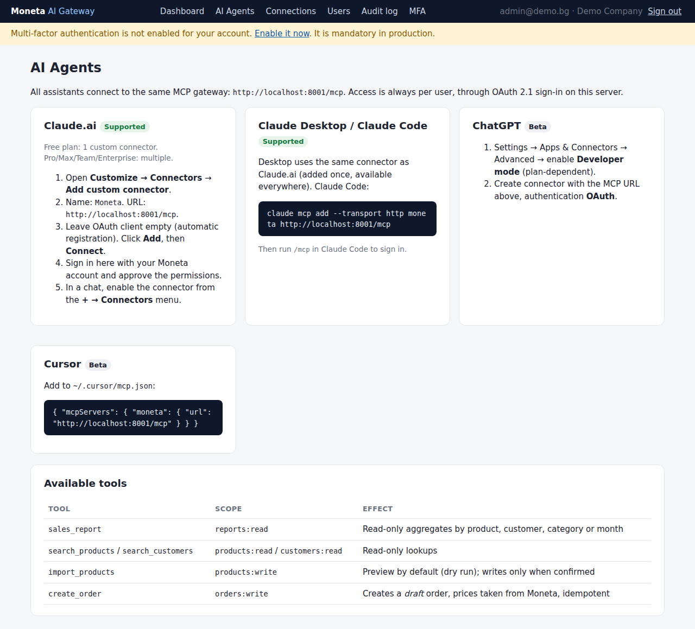
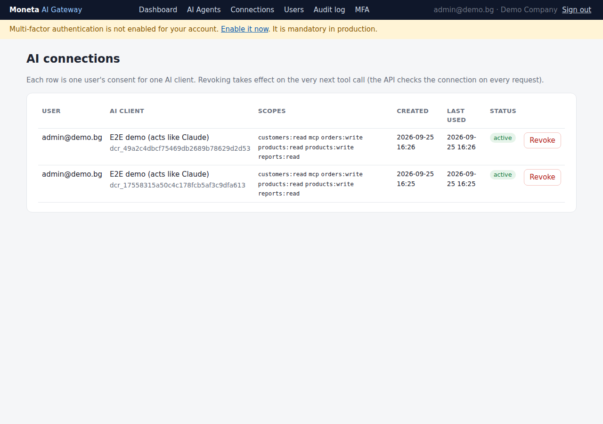
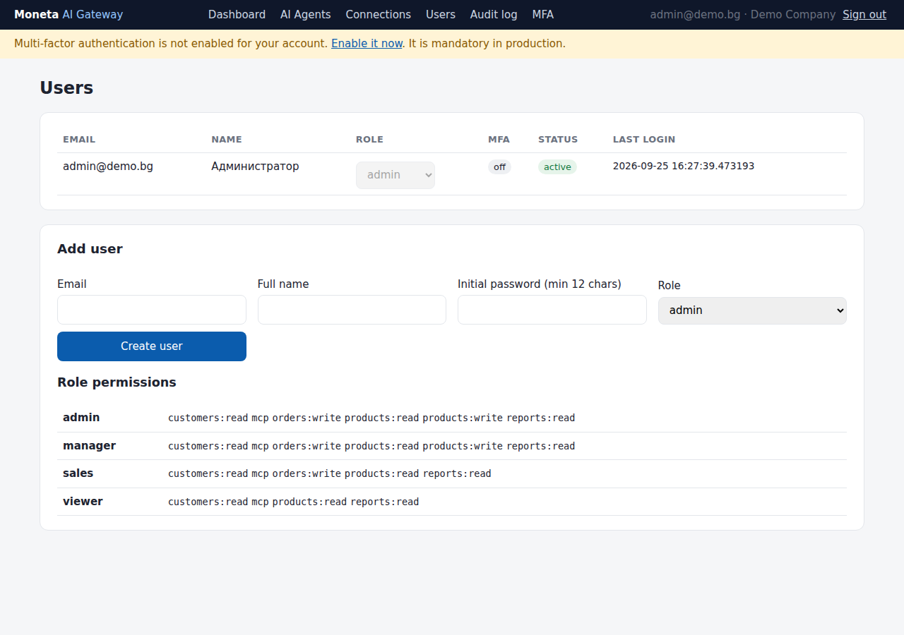
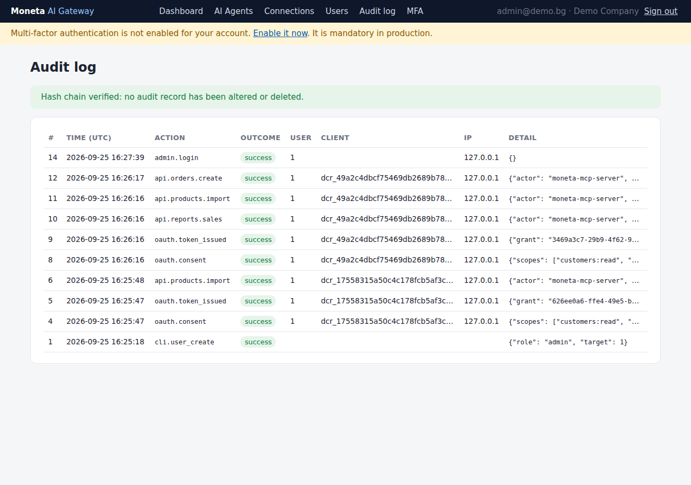

# 7. Administrator panel

URL: `<GATEWAY_PUBLIC_URL>/admin`. It is server-rendered with no JavaScript (CSP `default-src 'none'`). Only users with role **admin** can sign in, and each admin sees only their own tenant (customer company).

| Page | Purpose |
|---|---|
| **Dashboard** | User count, active AI connections, audit events and **denied attempts in the last 24 h**; the MCP URL to give to AI assistants |
| **AI Agents** | Catalogue of supported assistants (Claude.ai, Claude Desktop/Code, ChatGPT, Cursor) with per-assistant setup steps and the tool/scope table |
| **Connections** | Every user-to-AI-client consent (grant): scopes, created, last used, status, **Revoke** (effective on the next tool call) |
| **Users** | Create users (Argon2id, min 12 chars), change role, enable/disable (disabling revokes all their AI connections), unlock, reset MFA; role → scope table |
| **Audit log** | Last 200 events for the tenant, with **hash-chain verification** banner (green = intact) |
| **MFA** | TOTP enrolment (authenticator app). **Mandatory for admins** when `GATEWAY_ENVIRONMENT=prod` |

## Screenshots

**OAuth consent (what a user sees when connecting Claude):**

**Dashboard:**

**AI Agents:**

**Connections:**

**Users:**

**Audit log:**

## Typical admin tasks

* **Onboard an employee to Claude:** Users → Add user (role `sales` or `viewer`). The employee adds the connector in Claude.ai and signs in with that account. The connection appears under Connections.
* **Employee leaves:** Users → Disable. All their AI connections are revoked instantly.
* **Suspicious activity** (denied spikes on the dashboard, unexpected orders): Audit log → identify the user/client → Connections → Revoke → reset password/MFA.
* **Read-only pilot:** give everybody `viewer`. Write tools will then fail with a clear "permission denied" message.

## Security properties
Server-side sessions (30-minute idle timeout, new ID on login), `__Host-` `Secure` `HttpOnly` `SameSite=Strict` cookie, CSRF token on every form, login rate limit + lockout, all actions audited, cross-tenant IDs return 404.
