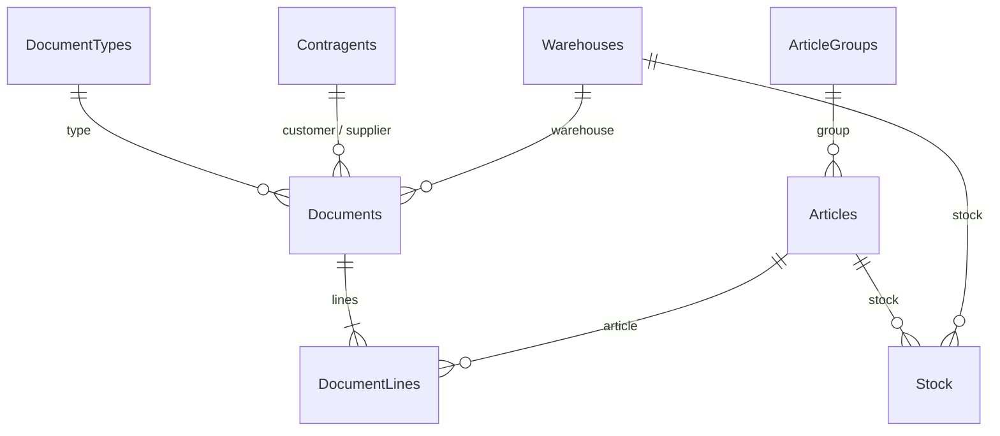

# 10. MonetaDemo: a local Moneta-like SQL Server database

A small ERP database in the style of Moneta, for developing and testing the AI gateway on your own PC with **SQL Server + SSMS**. It follows the usual company pattern: **tables + views + functions + stored procedures**. It also adds a strict security layer:

* **`dbo`**: the ERP tables. **Private.** The AI gateway gets no rights here.
* **`ai_api`**: views, functions and stored procedures the gateway is allowed to use. Nothing else.

All data is **fictional** ("Демо …" companies, placeholder EIKs/phones, `.example` e-mails). Document dates are relative to *today*, so reports always contain recent data.

Scripts: [`sql/moneta_demo/`](../sql/moneta_demo). Tested on SQL Server 2022; they use only features available since SQL Server 2016 SP1 (`CREATE OR ALTER`), so 2016/2017/2019/2022, Express or Developer all work.

---

## 1. What's inside



| Table (`dbo`) | Content | Demo rows |
|---|---|---|
| `Contragents` | Customers (C), suppliers (S), both (B): code, name, EIK, VAT number, МОЛ, address, payment term, credit limit | 18 |
| `ArticleGroups`, `Articles` | 4 groups, 28 articles: code, name, unit, barcode, purchase/sale price, VAT % | 4 / 28 |
| `Warehouses`, `Stock` | 2 warehouses (София, Пловдив), quantity per article per warehouse | 2 / 56 |
| `DocumentTypes` | `INV` Фактура, `CRN` Кредитно известие, `ORD` Поръчка, `DLV` Доставка | 4 |
| `Documents`, `DocumentLines` | 450 invoices over the last 12 months, 15 credit notes, 25 orders, 40 deliveries; 1-5 lines each | 530 / 1,560 |

Design details worth knowing:
* `DocumentLines.LineNet` / `LineVat` and `Documents.TotalGross` are **persisted computed columns**, so the maths can't drift.
* `DocumentTypes.SignFactor = -1` makes credit notes reduce sales. `CountsInTurnover` keeps orders and deliveries out of sales reports.
* All text is `NVARCHAR` with collation `Cyrillic_General_CI_AS` (Bulgarian sorting, case-insensitive search).
* `dbo.usp_RecalcDocumentTotals` recalculates a document's totals from its lines (for future write procedures).

### `ai_api` objects (what the API will use)

| Object | Type | Parameters | Returns |
|---|---|---|---|
| `v_Contragents`, `v_Articles`, `v_Stock`, `v_Documents`, `v_DocumentLines` | views | – | Clean, narrow column sets |
| `fn_SalesLines(@DateFrom, @DateTo)` | inline table function | period | Every sales line in turnover (credit notes negative) |
| `fn_LikePattern(@Search)` | scalar function | text | Safe LIKE pattern (`%`, `_`, `[` matched literally) |
| `usp_GetContragents` | procedure | `@Search, @ContragentType (C/S/B), @City, @OnlyActive, @Page, @PageSize` | Paged list + `TotalCount` |
| `usp_GetContragentByCode` | procedure | `@Code` | Card + `SalesNetLast12M`, `InvoicesLast12M`, `LastSaleDate` |
| `usp_GetArticles` | procedure | `@Search, @GroupCode, @OnlyInStock, @OnlyActive, @Page, @PageSize` | Paged list with price incl. VAT and total stock |
| `usp_GetArticleStock` | procedure | `@Code` | Quantity per warehouse |
| `usp_GetDocuments` | procedure | `@DateFrom, @DateTo (≤ 366 days), @DocTypeCode, @ContragentCode, @Status, @Page, @PageSize` | Paged document headers |
| `usp_GetDocument` / `usp_GetDocumentLines` | procedures | `@DocTypeCode, @DocNumber` | Header / lines |
| `usp_SalesReport` | procedure | `@DateFrom, @DateTo (≤ 366 days), @GroupBy (article/contragent/group/month/city), @Top` | Documents, quantity, net, gross per group |
| `usp_GetLookups` | procedure | – | Document types, article groups, warehouses |

Every procedure validates its input and raises a clear error: `50001` paging, `50002` invalid value, `50003` period, `50004` not found. The API will turn these into HTTP 400/404 responses. Lists are always paged (max 200 per page) and reports are capped, so nothing can dump a whole table.

---

## 2. Create it in SSMS (step by step)

1. Get the scripts on your PC: `git pull` in your `mcp-moneta` folder. They're in `mcp-moneta\sql\moneta_demo\`.
2. Open **SSMS** and connect to your local instance with **Windows Authentication**. Server name is usually `localhost`, `.` or `.\SQLEXPRESS`.
3. For each file **in this order**: **File → Open → File…**, select it, and press **F5** (Execute). Check the **Messages** tab for the "… ready" line.

   | # | File | Expected message |
   |---|---|---|
   | 1 | `01_create_database.sql` | `Database MonetaDemo created.` |
   | 2 | `02_tables.sql` | `Tables ready.` |
   | 3 | `03_functions.sql` | `Functions ready.` |
   | 4 | `04_views.sql` | `Views ready.` |
   | 5 | `05_procedures.sql` | `Stored procedures ready.` |
   | 6 | `06_seed_data.sql` | Row counts + `Demo data loaded.` |

4. Refresh **Databases** in Object Explorer: **MonetaDemo** appears with tables under `dbo` and views and procedures under `ai_api`.
5. Open **`08_examples.sql`**, select any `EXEC …` line and press **F5** to see results. For example, `EXEC ai_api.usp_SalesReport ... @GroupBy = 'month'` returns sales per month for the last year.

Every script is **safe to run again**: objects are created if missing or replaced, and the demo data is skipped if it already exists. To start completely fresh, run `99_drop_database.sql`, then 01–06 again.

### Alternative: terminal (PowerShell)

```powershell
cd C:\...\mcp-moneta\sql\moneta_demo
$server = "localhost"          # or ".\SQLEXPRESS"
foreach ($f in "01_create_database.sql","02_tables.sql","03_functions.sql","04_views.sql","05_procedures.sql","06_seed_data.sql") {
    sqlcmd -S $server -E -C -b -i $f
    if ($LASTEXITCODE -ne 0) { Write-Host "FAILED: $f"; break }
}
```

`-E` = Windows login, `-C` = trust the local server certificate (dev only), `-b` = stop on error. Older `sqlcmd` versions don't know `-C`; just drop it.

---

## 3. The read-only login for the gateway (`07_security.sql`)

The gateway will connect as **`moneta_ai_reader`**, a login that can **only** use `ai_api`:

| Action as `moneta_ai_reader` | Result |
|---|---|
| `EXEC ai_api.usp_GetContragents` | ✅ works |
| `SELECT * FROM ai_api.v_Articles` | ✅ works |
| `SELECT * FROM dbo.Contragents` | ❌ `The SELECT permission was denied` |
| `UPDATE dbo.Articles …` | ❌ denied |

This works through SQL Server **ownership chaining**: `ai_api` objects are owned by `dbo`, so they can read `dbo` tables on the caller's behalf, but the caller can't touch those tables directly. Even if someone stole the gateway's database password, they could only run these read-only procedures.

Steps:

1. **Allow SQL logins** (Express installs Windows-only by default): SSMS → right-click the **server** → **Properties** → **Security** → *SQL Server and Windows Authentication mode* → OK, then restart the service (right-click the server → **Restart**).
2. Open `07_security.sql` and change `N'CHANGE_ME'` to a strong password (12+ chars, upper/lower/digit/symbol). The script refuses to run while it still says `CHANGE_ME`.
3. Press **F5**. You should see `moneta_ai_reader can use schema ai_api only.`
4. Test it: **Connect → Database Engine** → *SQL Server Authentication*, user `moneta_ai_reader` and your password. Run `EXEC ai_api.usp_GetContragents;` (works) and `SELECT TOP 1 * FROM dbo.Contragents;` (denied).

Don't commit the password. `07_security.sql` in Git keeps `CHANGE_ME`; set the password only in your local copy, or undo the edit after running it.

---

## 4. Bringing in tables and data from a client database

When you copy real tables into your local SQL Server:

* **Use a separate database** (e.g. `Moneta_ClientCopy`), never the client's live one, and don't mix it into `MonetaDemo`.
* **Personal data** (contact names, e-mails, phones, EIK of sole traders) needs the client's agreement or anonymization **before** Claude reads it. Claude.ai Free chats can be used for training unless that's turned off in Settings → Privacy.
* **Easiest ways to copy:** SSMS → right-click the source database → **Tasks → Generate Scripts** (structure only), or **Tasks → Export Data…** (wizard) for selected tables with data.
* Then create `ai_api` views and procedures **over the copied tables**, with the same names and parameters as in `MonetaDemo`. The API won't need to change, only the view and procedure bodies.

---

## 5. Next step: API GET methods

The next iteration connects the gateway to `MonetaDemo` as `moneta_ai_reader` and adds GET endpoints plus MCP tools on top of these procedures: contragents, articles, stock, documents with lines, and the sales report. The connection line will look like this (SQL login, local instance):

```ini
GATEWAY_ERP_DATABASE_URL="mssql+pyodbc://moneta_ai_reader:<password>@localhost:1433/MonetaDemo?driver=ODBC+Driver+18+for+SQL+Server&Encrypt=yes&TrustServerCertificate=yes"
```

For a named instance like `.\SQLEXPRESS`: enable TCP/IP and a fixed port in *SQL Server Configuration Manager*, then use `localhost:<port>`. `TrustServerCertificate=yes` is acceptable only for a local dev instance.
